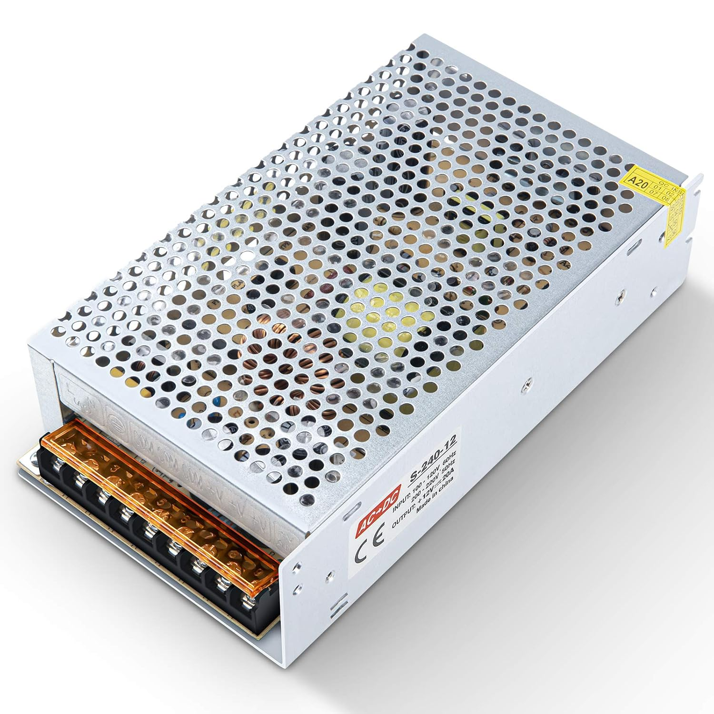
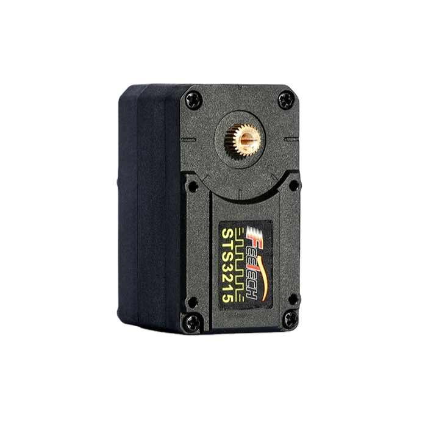

# Bill of Materials

Total approx price **XX,XX€**

| Qty  | Item                                                | Image                                                        | Description                                                 | Link                                                         | Pack Price (€) | Pack Size | Unit Price (€) | Subtotal (€) |
| ---- | --------------------------------------------------- | ------------------------------------------------------------ | ----------------------------------------------------------- | ------------------------------------------------------------ | -------------- | --------- | -------------- | ------------ |
| 2    | [Board](./BOM/board.md)             |                           | Waveshare serial bus servo driver board | [Amazon](https://www.amazon.es/dp/B0CJ6TP3TP) | 11.99     | 1         | 11.99     | 23.98 |
| 4 | Clamps |  |Xiaomoyu 4|[Amazon](https://www.amazon.es/dp/B08S6Z7S4V)|9.88|4|2.47|9.88|
| 1 | [Power Supply](./BOM/power_supply.md) |  |Kingwen Power AC 100V / 240V to  DC 12V 20A 240W.|[Amazon](https://www.amazon.es/dp/B08QDDY412?th=1)|24.00|1|24.00|24.00|
| 1 | [Switch](./BOM/switch.md) |  |Tiardey 16A 220V Switch with LED|[Amazon](https://www.amazon.es/dp/B09PFVM25C)|9.99|1|9.99|9.99|
| 12 | [Servos](./BOM/STS3215_servo.md) |  |6PCS 12V  30KG  STS3215  High Torque Intelligent Bus Servo TTL  Robotic Arm for Programming  Four Working Modes with FE-URT-1|[Alibaba](https://www.alibaba.com/product-detail/6PCS-12V-30KG-STS3215-High-Torque_1601216757543.html)|105.66$|6|26.42|105.66$|
