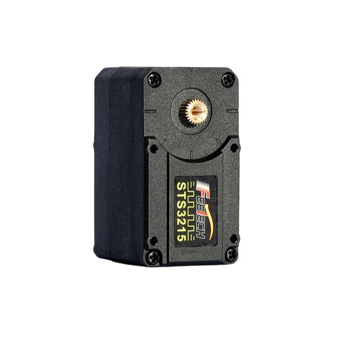

# STS3215 Servo

6PCS 12V  30KG  STS3215  High Torque Intelligent Bus Servo TTL  Robotic Arm for Programming  Four Working Modes with FE-URT-1 [Alibaba](https://www.alibaba.com/product-detail/6PCS-12V-30KG-STS3215-High-Torque_1601216757543.html)

## Info from customer service chat after purchasing the Alibaba kit 

Please download software from the following link:
SCS/STS servo, which contains open source code, FD, FM, FT software and driver, protocol and code, library 6 files:
FD software the latest version, compatible with FE-URT-1
https://gitee.com/ftservo
Drive installation
CH340C driver download address:
Http://www.wch.cn/download/CH341SER_EXE.html
And download the FT debug here:
https://gitee.com/ftservo

How to change the ID of Feetech SCS servos, Please refer to the steps from the below link:
https://www.youtube.com/watch?v=GX-KO-Zlhtw

Contact Jenny Deng to request datasheet:
1.The memory table
2.The start toturial
3.Arduino Library
4.The Communication Protocol

Local copy of documents sent by customer service in folder [assets/feetech](./assets/feetech/) 
