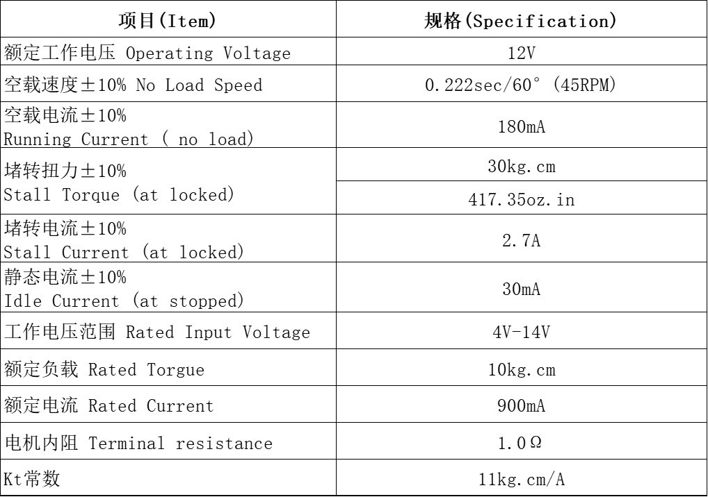

# STS3215 Servo Kit

[Alibaba kit](https://www.alibaba.com/product-detail/6PCS-12V-30KG-STS3215-High-Torque_1601216757543.html): 6PCS 12V  30KG  STS3215  High Torque Intelligent Bus Servo TTL  Robotic Arm for Programming  Four Working Modes with FE-URT-1 

## FE-URT-1 board

 [FE-URT-1](https://www.feetechrc.com/FE-URT1-C001.html) ships as part of the Alibaba ST3215 servo kit

## ST3215 12V 30kg specs

https://www.feetechrc.com/525603.html

PDF specs sheet: [ST-3215-C018-20230720.pdf](./assets/ST-3215-C018-20230720.pdf)

 

## Resources

The manufacturer documentation (https://www.feetechrc.com/software.html) ) is in Chinese, except this [start tutorial](https://www.feetechrc.com/Data/feetechrc/upload/file/20201127/start%20%20tutorial201015.pdf) (saved a local copy [here](./assets/start  tutorial201015.pdf)) so I made a crude English translation of the User Manual: [FE-URT-1 User Manual Translated.md](./FE-URT-1_User_Manual_Translated.md). 

Also check out this [demo video of the servos and the debugging GUI](./assets/Video_ST3215_12V_30kg.mp4) I found in [Aliexpress](https://es.aliexpress.com/item/1005007708969582.html?gatewayAdapt=glo2esp)

After purchasing the kit from Alibaba their Customer Service chat (Jenny Deng) sent some instructions:

Local copy of documents sent:

* [Memory table](./assets/feetech/STS_Memory_Table.xlsx)

* [Start tutorial](./assets/feetech/feetech_servo_start_tutorial.pdf)
* [Arduino Library](./assets/feetech/SCServo_Arduino_220524.7z)
* [Communication Protocol](./assets/feetech/RS485_Bus_Servo_Communication_Protocol_Manual210923.pdf)
* [FD software?](./assets/feetech/FD1983-231205.zip)

Other instructions (not explored):

Please download software from the following link:

SCS/STS servo, which contains open source code, FD, FM, FT software and driver, protocol and code, library

6 files:

FD software the latest version, compatible with FE-URT-1: https://gitee.com/ftservo

CH340C driver download address: Http://www.wch.cn/download/CH341SER_EXE.html

And download the FT debugger here: https://gitee.com/ftservo

How to change the ID of Feetech SCS servos, Please refer to the steps from the below link: https://www.youtube.com/watch?v=GX-KO-Zlhtw

