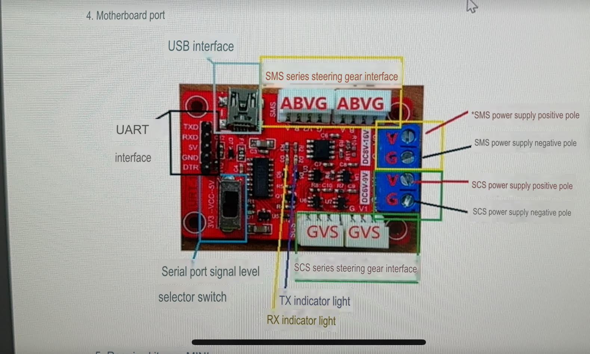
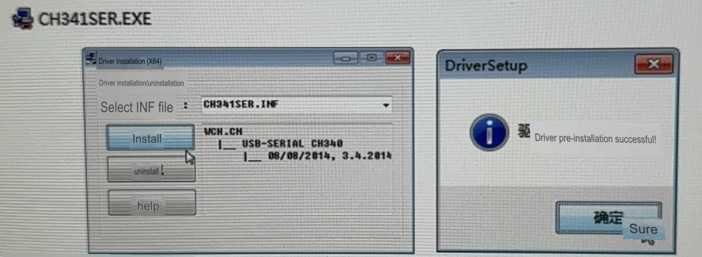
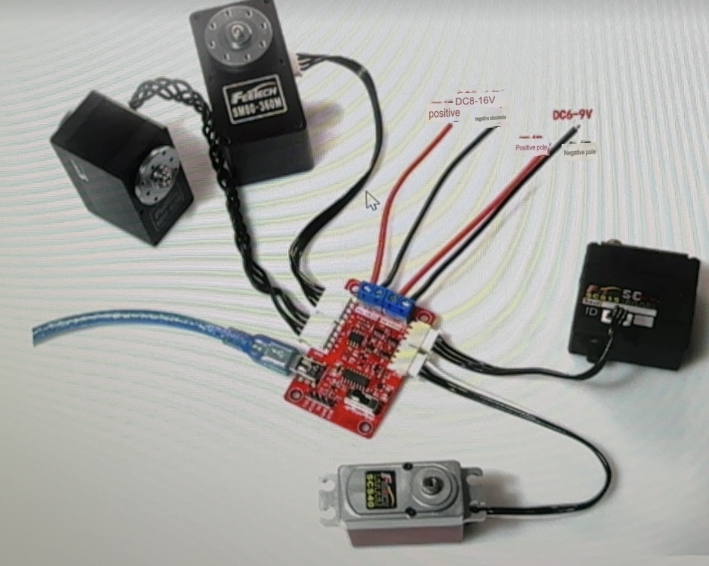

### **URT-1 User Manual**

**Multifunctional Serial Signal Converter**
(USB/UART to SMS (RS485) & SCS (TTL))
**Date**: 2017/10/8
**Manufacturer**: Shenzhen FeiTe Model Co., Ltd.

------

### 1. **Overview**

The URT-1 Multifunctional Serial Signal Converter is designed to facilitate debugging and integration of FeiTe SMS and SCS series servo motors.

The URT-1 integrates a USB-to-serial chip and a linear low-dropout voltage regulator circuit, enabling the conversion of USB signals to 5V or 3.3V serial signal levels.

The serial signals in the URT-1 board are processed through a signal conversion circuit to produce two signal outputs with different voltage levels:

- **Channel A**: Asynchronous half-duplex RS485-level port for SMS series servos.
- **Channel B**: Asynchronous half-duplex TTL-level single-bus port for SCS series servos.

The signal output and input of the URT-1 board use asynchronous time-sharing hardware circuits for automatic signal routing without requiring extra enable IOs, reducing MCU port usage and simplifying code development.

**Connectors:**

- USB: Mini USB interface.
- UART: Standard 2.54mm pin headers.
- SMS series servo: 5264-4AW connector (directly connects to servos).
- SCS series servo: 5264-3AW connector (directly connects to servos).

**Power Notes:** Since SMS and SCS series servos operate at different voltages, they must use separate voltage inputs. Alternatively, power from the high-voltage SMS supply can be stepped down to power the SCS input. A single power supply can then be used for the entire system.

The power port has an overcurrent limit of 6A. If additional servos are needed in series, ensure proper power distribution. The URT-1 serves only as a signal converter.

------

### 2. **Features**

- Full-speed USB device interface, compatible with USB V2.0.
- Communication baud rates: 50bps to 1Mbps.
- Supports switchable 5V and 3.3V UART signal levels.
- Compatible with 32/64-bit Windows (10/8.1/8/7/VISTA/XP) and server editions (2016/2012/2008/2003).
- Certified by Microsoft Digital Signature.
- Supports SMS and SCS series servos using a shared serial port.
- Asynchronous half-duplex communication with automatic hardware signal routing (no extra enable IO needed).
- Anti-reverse connection design ensures correct servo connections.
- UART interface features standard pin headers for use as a USB-to-serial output or as a connection to MCU UARTs for controlling servos.
- Equipped with indicator lights:
  - Signal level and power indicator (D1).
  - TX (D2) and RX (D3) indicators for monitoring data flow.
- USB-powered with 500mA overcurrent and overvoltage protection.

------

### 3. **Specifications**

- **Weight**: 12.5g.
- **Dimensions**: 55.8mm x 36.6mm x 11.5mm.
- **Mounting Dimensions**: 48.8mm x 28.8mm.
- **USB Interface**: Mini USB.
- **UART Interface**: 2.54mm pin headers.
- **SCS Servo Interface**: 3-pin 5264-3AW.
- **SMS Servo Interface**: 4-pin 5264-4AW.
- **Servo Power Interface**: 5.08mm terminal block.

------

### 4. **Mainboard Ports**

------

### 5. **Required Accessories**

- Mini USB cable.
- Servo power supply and cables.
- Servo-to-servo connection cables.
- Dupont cables (optional).

------

### 6. **Driver Installation**

- **Driver Download URL**: [CH340C Driver](http://www.wch.cn/download/CH341SER_EXE.html).
- After downloading, run the installer and follow on-screen instructions.
- Do not close the installer until installation is complete.

Once installed, or if the driver was previously installed, connecting the URT-1 to a PC's USB port will display the corresponding port number in the Device Manager.

------

### 7. **Hardware Connections**

1. Connect the appropriate servos to their corresponding ports.
2. Ensure the power supply is correctly connected to the servo power port. Be careful not to reverse the polarity.
3. Use a Mini USB cable to connect the URT-1 to a PC.

------

### 8. **Software Testing**

- Test using **FD software**.
- Test using **Serial Debug Assistant**.