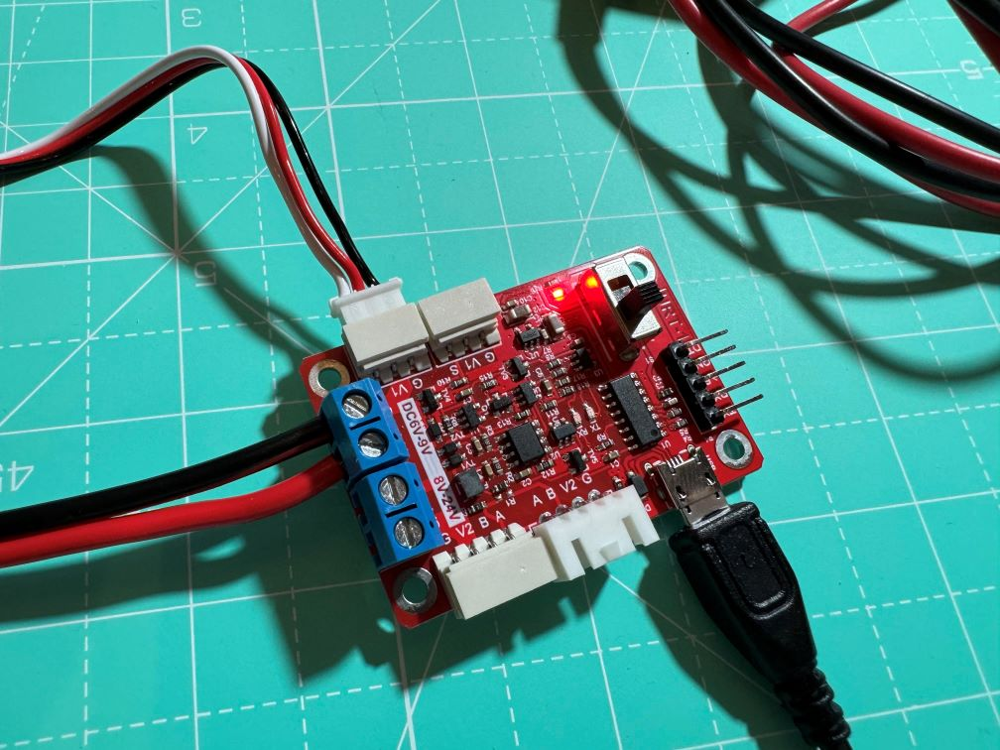
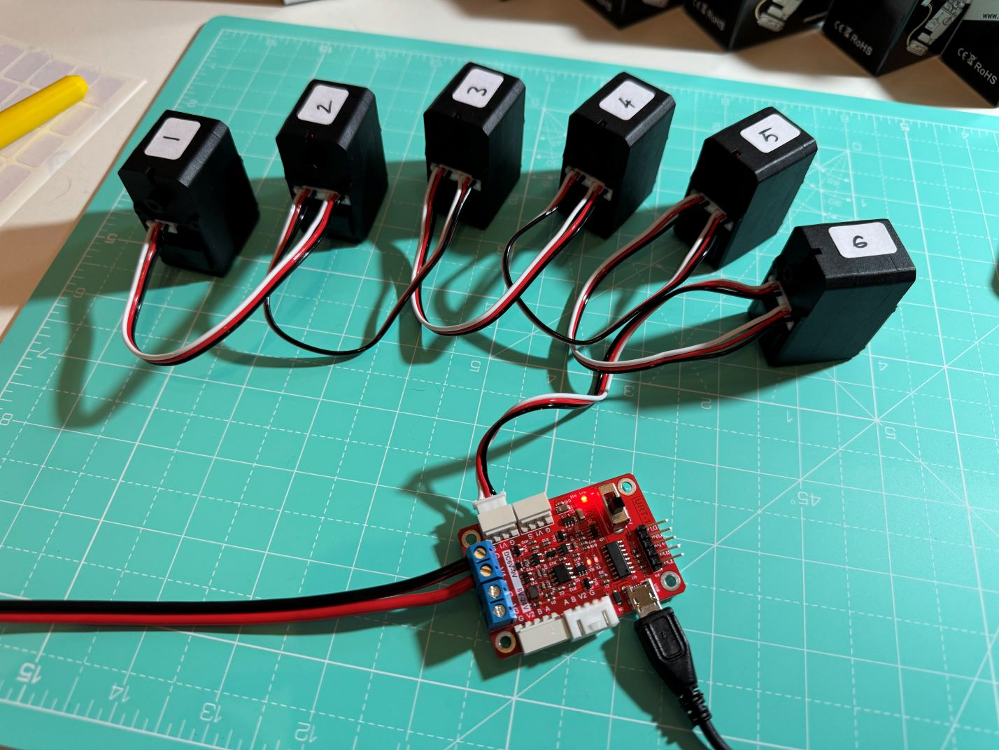
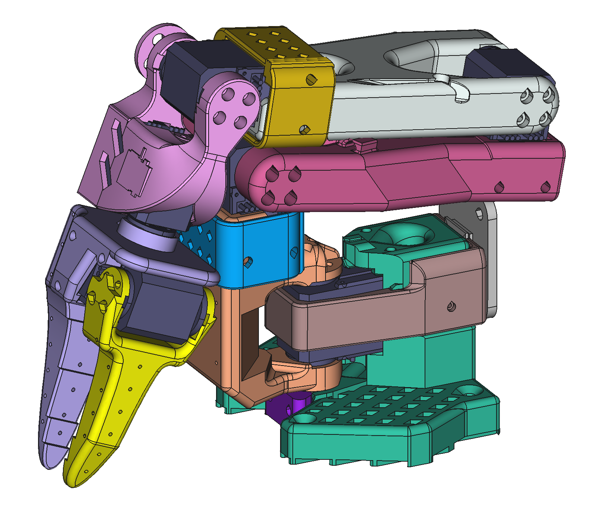

# Setting up Servos ST3215 (12V, 30kg)

1. Download from [Feetech website](https://www.feetechrc.com/software.html) (both packages are for Windows systems):

- the FE-URT-1 board driver

* the debugging GUI `FD.EXE` (version FD1.9.8.3) 

2. Install the driver `CH341SER.EXE`
3. Connect the board to a 12V power supply and to the USB. Check switch is set to 5V. Connect the Servo. **Note: Had to connect 12V input to G - V1 terminals, even though they are rated DC6V-8V. If I connect to G-V2 (rated 8V-24V) it would not work!!** Did this by executive decision, I found nothing online.



2. Check in **Device Manager** under **Ports**: `USB-SERIAL CH340 (COM4)`
3. Install and launch `FD.EXE`
4. In **Debug** tab, set **BaudR** to 1000000, then click **Open** then **Search** to find the servos
5. Click on the detected Servo, go to tab **Programming**, select **ID**, rename to 6 , click **Save**
6. Connect another servo in daisy chain, repeat the process and rename it to 5, then 4, etc until 1.



7. In **Debug** tab, select the **Sync Write** toggle, set **Goal** to 2048 then click **Set** to zero all servos to the middle point.

## Sources

* This Youtube video [Standard Open ARM 100 5DOF Servos - Low cost DIY 3dprinted robot arm for Le Robot by Hugging Face](https://www.youtube.com/watch?v=fy6Jqq_QaGo) describes the connection and renaming steps, but skips the installation of the software, and is for the 6V version not the 12V one.

* Documentation is in Chinese except this [start tutorial](https://www.feetechrc.com/Data/feetechrc/upload/file/20201127/start%20%20tutorial201015.pdf) (saved a local copy [here](./assets/start  tutorial201015.pdf))
* I translated the FE-URT-1 User Manual to English, see [here](FE-URT-1 User Manual Translated.md). 
* Also check out this [spec sheet](./assets/Specs_ST3215_12V_30kg.jpg) and [demo video of the servos and the debugging GUI](./assets/Video_ST3215_12V_30kg.mp4) I found in [Aliexpress](https://es.aliexpress.com/item/1005007708969582.html?gatewayAdapt=glo2esp)
* Customer Service chat linked to [resources](./BOM/STS3215_servo.md) after purchasing the kit from Alibaba

# Assembly of the Follower Arm

I followed the [Build guide for Standard Open ARM 100 5DOF - Low cost DIY 3dprinted robot arm Le Robot Hugging Face](https://www.youtube.com/watch?v=QkIgxTCq3MY), which actually describes the assembly of an older version (5d). The current version (8k) contains more parts and the assembly sequence is slightly different.

The repo includes a STEP file of the current version [here](https://github.com/TheRobotStudio/SO-ARM100/tree/main/STEP). I imported it into FreeCAD, exploded it into parts as explained [here](https://www.youtube.com/watch?v=4UITPBWyehs) and coloured them differently for easier identification (see the resulting FreeCAD model [here](./CAD/SO_5DOF_ARM100_08k.FCStd)):  



Each servo comes with 9x metal screws + 8x self-tapping screws + 1x flanged self-tapping screw. The assembly uses exclusively the screws provided with the servos.

1. On all servos, install the drive wheel (the one with grooves) on the drive axle, trying to align the four holes with the sides of the servo. Secure it in place using one metal screw through the centre. 

2. On all servos (except **Servo_#2**) insert the free wheel (the one without grooves) in the free axle, but do not install the flanged self-tapping screw provided to fix it, as it impairs rotation
3. Insert **Servo_#6** into the **Base** (green) with the drive axle pointing upwards. Route the cable going to the board downwards through the hole in the **Base**.
4. Insert the **Base_Collar** (brown) holding together the **Base**  and **Servo_#6**, taking care to route the cable from **Servo_#6** to **Servo_#5** through the inside of **Base_Collar** without pinching it - there is a dedicated gap - and then clip the cable in the dedicated vertical slot in **Base**. Fix the **Base_Collar** in position with 2 self-tapping screws. 
5. Secure **Servo_#6** to the **Base** with 2 additional self-tapping screws from the top
6. Prepare the **Shoulder** (orange): preload the 4 metal screws that will later be used to attach to the free wheel of **Servo_#6** . Cover them with an additional free wheel (taken from **Servo_#2**) and attach it with a flanged self-tapping screw. There is a dedicated video with instructions for this complicated step: [Assembly Detail](https://www.youtube.com/watch?v=temou_Nr5s8) 
7. Install the **Shoulder** bracing the drive and free wheels of **Servo_#6**. Attach the **Shoulder** to the drive wheel using 4x metal screws, taking care that the **Shoulder** should be pointing forward when the servo is at the central position. Install 4x metal screws to secure the free wheel to the **Shoulder**, rotating it to get access to the holes as needed. 
8. Secure the extra free wheel in place fixing the **Stopper** (purple) to the **Base** with two self-tapping screws
9. Insert **Servo_#5**  into the slot at the top of the **Shoulder** with the drive wheel facing towards the right,                                   and secure it in place with the **Collar** (blue) taking care not to pinch the cable coming from **Servo_#6**. Secure the set of three parts in place with 4 self-tapping screws.
10. Install the **Lower_Arm** (red) bracing the drive and free wheels of **Servo_#5**. Attach the **Lower_Arm** to the drive wheel of **Servo_#5** using 4 metal screws, taking care that when the servo is at the central position, the **Lower_Arm** should be pointing upwards. Route the cable to **Servo_#4** through the clip on the left side of the **Lower_Arm**. 
11. Insert **Servo_#4**  into the slot at the top of the **Lower_Arm** with the drive wheel facing towards the right,  and secure it in place with 4 self-tapping screws. Route the cable to **Servo_#3** through the groove on the left side of the **Lower_Arm** and secure it with a flanged self-tapping screw. 
12. Install the **Upper_Arm** (white) bracing the drive and free wheels of **Servo_#4**. Attach the **Upper_Arm** to the drive wheel of **Servo_#4** using 4 metal screws, taking care that when the servo is at the central position, the **Upper_Arm** should be point forward. Route the cable to **Servo_#3** through the groove on the left side of the **Upper_Arm** and secure it with a flanged self-tapping screw.
13. Insert **Servo_#3**  into the slot at the top of the **Upper_Arm** with the drive wheel facing towards the right. Insert the **Collar** (gold) taking care not to pinch the cable coming from **Servo_#4** and secure the assembly of three parts in place with 4 self-tapping screws.   
14. Prepare the **Wrist** (pink) by first installing **Servo_#2** inside it, with the drive wheel facing forward and no free wheel. Push it in until the surface if flush. Secure it with 2 self-tapping screws in the holes provided plus 1 flanged self-tapping screw on the hole of the free axle.
15.  Install **Wrist** bracing the drive and free wheels of **Servo_#3** . Attach the **Wrist** to the drive wheel of **Servo_#3** using 4x metal screws, taking care that when the servo is at the central position, the **Wrist** should be pointing forward. Attach the free wheel with 4 metal screws.
16. Attach the **Fixed_Gripper** (light purple) to the drive wheel of **Servo_#2** using 4 metal screws, taking care that when the servo is at its central position, the gripper should be horizontal, with the **Fixed_Gripper** on the right side.
17. Install **Servo_#1** onto **Fixed_Gripper** in the dedicated slot, with the drive wheel pointing upwards and secure it with 6 self-tapping screws.
18. Attach the **Movable_Jaw** (yellow) to the drive wheel of **Servo_#1** using 4 metal screws, taking care that when the servo is at its central position, the **Movable_Jaw** should point forward. Attach the free wheel with 4 metal screws.

The board support fits the [Waveshare 25514 Serial Bus Servo Driver Board](https://www.waveshare.com/bus-servo-adapter-a.htm) referred to in the BOM, but not the [FE-URT-1](https://www.feetechrc.com/FE-URT1-C001.html) included in the [Alibaba kit](https://www.alibaba.com/product-detail/6PCS-12V-30KG-STS3215-High-Torque_1601216757543.html) and referred to in the build guide. Which one to use?

### Sources

* Playlist of SO-ARM100 videos from The Robot Studio (many are repeated): https://www.youtube.com/playlist?list=PLy7gxZH9jzfR0l8fYH8C1nyEc4pxSBrer
* Resources for the Waveshare 25514 board: [wiki](https://www.waveshare.com/wiki/Bus_Servo_Adapter_(A))

## Software

Followed instructions here: https://github.com/huggingface/lerobot/blob/main/examples/10_use_so100.md

### Install LeRobot

**Note:** during miniconda installation I got a WARNING that PYTHONPATH environment variable is set and I should check all files in the path are compatible with python version in miniconda (??)

ChatGPT recommends manually:

```bash
$ unset PYTHONPATH
$ conda activate lerobot
```

or make it permanent modifying the conda environment activation script


**Note:** After installation when I open a terminal I get the prepend `(base) $`. How does this affect ROS?

Avoid auto activation of base with:

```bash
$ conda config --set auto_activate_base false
```

Then activate it manually only when needed...


**Note:** during the process, I conda installed ffmpeg, removed opencv and reinstalled it with conda

### Configuring the motors (with the waveshare board)

Check out this new video that describes motor configuration: https://www.youtube.com/watch?v=FioA2oeFZ5I 

Actually describes the full process, even has an animation of the assembly process for the current version (8k), I wish I had seen it earlier! 

Starting lerobot:

```bash
$ cd ~/lerobot
$ unset PYTHONPATH
$ conda activate lerobot
```

Detect the port:

```bash
(lerobot)$ python lerobot/scripts/find_motors_bus_port.py
```

Rename the servos:

```bash
(lerobot)$ python lerobot/scripts/configure_motor.py \
  --port /dev/ttyACM0 \
  --brand feetech \
  --model sts3215 \
  --baudrate 1000000 \
  --ID 1
```

Note: This script does not work on the assembled robot because it renames motors one by one...

Note: need to remove gears from the servos of the leader arm! (why buy the 30kg servos then?) 

The calibration script mentioned in the video does not exist...

### Crude python script

See [./scripts/README.md](./scripts/README.md)