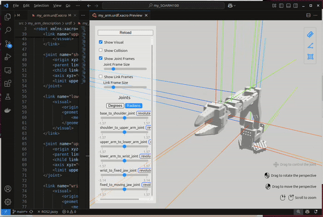

# Modeling the arm from scratch

We will create description package for the arm from scratch ready to later be symplinked into our workspace iaw **"the good way to download code from internet":tm:**, see [notes on ETH Zurich course](https://github.com/mhered/ROS-notes/blob/main/ROS-notes/ROS_ETH_Zurich_L1.md). 

Note: If you don't have a workspace yet, create and initialize it with:

```bash 
$ mkdir -p ~/dev_ws/src
$ cd dev_ws
$ colcon build
                     
Summary: 0 packages finished [0.20s]
```


Create new package `my_arm_description` in a new `/src/`folder inside this repo `my_SOARM100` (use the default build type `ament_cmake`)

```bash
$ mkdir ~/my_SOARM100/src/ && cd ~/my_SOARM100/src/
$ ros2 pkg create --build-type ament_cmake my_arm_description
going to create a new package
[...]
```

2. Symlink the package to the workspace `dev_ws`

```bash
$ ln -s ~/my_SOARM100/src/my_arm_description ~/dev_ws/src/
```

3. Build the workspace

```bash
$ cd ~/dev_ws
$ colcon build --symlink-install
Starting >>> my_arm_description
Finished <<< my_arm_description [0.46s]                  

Summary: 1 package finished [0.67s]
```

4. In a new terminal activate the workspace and check that the new package is available:

```bash
$ cd ~/dev_ws
$ source install/setup.bash
$ ros2 pkg list | grep my_arm_description
my_arm_description
```

In the new package let's create:

* a new folder `urdf` and a new file `my_arm.urdf.xacro` inside it
* a new folder `meshes` to put the STL files (from the [TheRobotStudio repo](https://github.com/TheRobotStudio/SO-ARM100/tree/main/URDF/SO_5DOF_ARM100_8j_URDF.SLDASM/meshes)). 
* Note: for consistency, rename `Moving Jaw.STL` to `Moving_Jaw.STL`

Result:

```bash
$ cd src && tree my_arm_description
my_arm_description
├── CMakeLists.txt
├── include
│   └── my_arm_description
├── meshes
│   ├── Base.STL
│   ├── Fixed_Jaw.STL
│   ├── Lower_Arm.STL
│   ├── Moving_Jaw.STL
│   ├── Rotation_Pitch.STL
│   ├── Upper_Arm.STL
│   └── Wrist_Pitch_Roll.STL
├── package.xml
├── src
└── urdf
        └── my_arm.urdf.xacro

6 directories, 10 files
```

We create a stub of the xacro file with two links and a joint:

```xml
<?xml version="1.0" encoding="utf-8"?>
<robot xmlns:xacro="http://www.ros.org/wiki/xacro" name="my_arm">
    <link name="world" />
    <link name="base_link">
        <visual>
            <origin xyz="0.0 0.0 0.0" rpy="0 0 0" />
            <geometry>
                <mesh filename="package://my_arm_description/meshes/Base.STL" />
            </geometry>
        </visual>
    </link>
    <joint name="world_to_base_joint" type="fixed">
        <origin xyz="0.0 0.0 0.0" rpy="0 0 0" />
        <parent link="world" />
        <child link="base_link" />
    </joint>
</robot>
```

Edit `CMakeLists.txt` to install the new folders `urdf` and `meshes` :

```cmake
...
#install folders
install(DIRECTORY
  meshes
  urdf
  DESTINATION share/${PROJECT_NAME}
)
...
```

Build the workspace with `$ colcon build --symlink-install`, activate it in another terminal activate and visualize the model using `urdf_tutorial` package (if it is not already installed, run `$ sudo apt-get install ros-jazzy-urdf-tutorial`)  

```bash
$ source install/setup.bash
$ ros2 launch urdf_tutorial display.launch.py model:=/home/mhered/dev_ws/src/my_arm_description/urdf/my_arm.urdf.xacro 
```


Adding this to `.vscode/settings.json` allows using URDF visualizer from vscode:

```JSON
{
    "urdf-visualizer.packages": {
        "my_arm_description": "${workspaceFolder}/src/my_arm_description"
    }
}
```


Next we add robot links one by one, let's walk through the first example:

```xml
...
 <joint name="base_to_shoulder_joint" type="revolute">
        <origin xyz="0 -0.0452 0.0165" rpy="0 0 0" />
        <parent link="base_link" />
        <child link="shoulder_link" />
        <axis xyz="0 0 1" />
        <limit upper="${pi/2}" lower="-${pi/2}" effort="1.0" velocity="1.0" />
    </joint>

    <link name="upper_arm_link">
        <visual>
            <origin xyz="0 0 0" rpy="0 ${pi/2} 0" />
            <geometry>
                <mesh filename="package://my_arm_description/meshes/Upper_Arm.STL" />
            </geometry>
        </visual>
    </link>
...
```

To note:

* by convention, I aligned in each case the STL model in its frame of reference so that the revolution axis is the z axis (blue) using the `<origin>` tag of the `<link>`, in this example: `<origin xyz="0 0 0" rpy="0 ${pi/2} 0" />`
* then applied translation and rotation to the `<origin>`  of the`<joint>` to place the joint in the proper place, in this case: `<origin xyz="0 -0.0452 0.0165" rpy="0 0 0" />`. I had previously assembled the robot in FreeCAD but found some values and axis orientations were not working, not sure why, so I fine-tuned using the URDF viewer vscode extension.
* rotation joints are of type`revolute` and require tags `<axis>`and `<limit>` to be set up correctly to be able to move them in URDF viewer. Since I always placed the rotation axis at Z, `<axis xyz="0 0 1" />` works for all, and similarly `<limit upper="${pi/2}" lower="-${pi/2}" effort="1.0" velocity="1.0" />` 

###### 

[...]

**Note: Several steps missing, check git log**

[...]

### Approach

```bash
$ ros2 topic pub /soarm100_controller/joint_trajectory trajectory_msgs/msg/JointTrajectory "header:
  stamp:
    sec: 0
    nanosec: 0
  frame_id: ''
joint_names:
- base_to_shoulder_joint
- shoulder_to_upper_arm_joint
- upper_arm_to_lower_arm_joint
- lower_arm_to_wrist_joint
- wrist_to_fixed_jaw_joint
- fixed_to_moving_jaw_joint
points:
- positions: [0.25, -0.2, -0.3, 0.1, -1.2, 1]
  time_from_start:
    sec: 1
    nanosec: 0"

```


### Grab

```bash
$ ros2 topic pub /soarm100_controller/joint_trajectory trajectory_msgs/msg/JointTrajectory "header:
  stamp:
    sec: 0
    nanosec: 0
  frame_id: ''
joint_names:
- base_to_shoulder_joint
- shoulder_to_upper_arm_joint
- upper_arm_to_lower_arm_joint
- lower_arm_to_wrist_joint
- wrist_to_fixed_jaw_joint
- fixed_to_moving_jaw_joint
points:
- positions: [0.25, -0.2, -0.3, 0.1, -1.2, -0.1]
  time_from_start:
    sec: 1
    nanosec: 0"

```


### Lift

```bash
$ ros2 topic pub /soarm100_controller/joint_trajectory trajectory_msgs/msg/JointTrajectory "header:
  stamp:
    sec: 0
    nanosec: 0
  frame_id: ''
joint_names:
- base_to_shoulder_joint
- shoulder_to_upper_arm_joint
- upper_arm_to_lower_arm_joint
- lower_arm_to_wrist_joint
- wrist_to_fixed_jaw_joint
- fixed_to_moving_jaw_joint
points:
- positions: [0, 0, 0, 0, 0, -0.3]
  time_from_start:
    sec: 1
    nanosec: 0"

```


### Drop

```bash
$ ros2 topic pub /soarm100_controller/joint_trajectory trajectory_msgs/msg/JointTrajectory "header:
  stamp:
    sec: 0
    nanosec: 0
  frame_id: ''
joint_names:
- base_to_shoulder_joint
- shoulder_to_upper_arm_joint
- upper_arm_to_lower_arm_joint
- lower_arm_to_wrist_joint
- wrist_to_fixed_jaw_joint
- fixed_to_moving_jaw_joint
points:
- positions:  [-0.5, -0.7, -0.5, 1.2, -1.6, -0.2]
  time_from_start:
    sec: 1
    nanosec: 0"

```


### Rest

```bash
$ ros2 topic pub /soarm100_controller/joint_trajectory trajectory_msgs/msg/JointTrajectory "header:
  stamp:
    sec: 0
    nanosec: 0
  frame_id: ''
joint_names:
- base_to_shoulder_joint
- shoulder_to_upper_arm_joint
- upper_arm_to_lower_arm_joint
- lower_arm_to_wrist_joint
- wrist_to_fixed_jaw_joint
- fixed_to_moving_jaw_joint
points:
- positions: [0.0, 1.75, -1.55, -1.2, 0, -0.2]
  time_from_start:
    sec: 1
    nanosec: 0"

```
