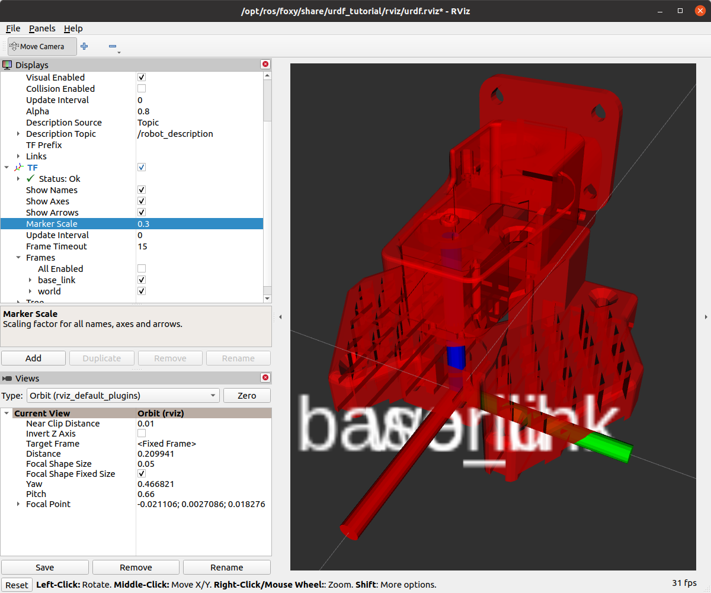

# Modeling the arm

Create and initialize a new workspace:

```bash 
$ mkdir -p ~/arm_ws/src
$ cd arm_ws
$ colcon build
                     
Summary: 0 packages finished [0.20s]
```

Instead of writing the packages directly in `src/` we will create a `src/`folder in the `my_SOARM100` repo and then symlink the packages to the workspace iaw **the good way to download code from internet**, see [notes on ETH Zurich course](https://github.com/mhered/ROS-notes/blob/main/ROS-notes/ROS_ETH_Zurich_L1.md). 

create new package `my_SOARM100_description` in a new `/src/`folder inside the repo `my_SOARM100` (use the default build type `ament_cmake`)

```bash
$ mkdir ~/my_SOARM100/src/ && cd ~/my_SOARM100/src/
$ ros2 pkg create --build-type ament_cmake my_arm_description
going to create a new package
[...]
```

2. Symlink the package to the workspace `arm_ws`

```bash
$ ln -s ~/my_SOARM100/src/my_arm_description ~/arm_ws/src/my_arm_description
```

3. Build the workspace

```bash
$ cd ~/arm_ws
$ colcon build --symlink-install
Starting >>> my_arm_description
Finished <<< my_arm_description [0.46s]                  

Summary: 1 package finished [0.67s]
```

4. In a new terminal activate the workspace and check that the new package is available:

```bash
$ cd ~/arm_ws
$ source install/setup.bash
$ ros2 pkg list
[...]
message_filters
my_arm_description
nav2_amcl
[...]
```

In the new package let's create:

* a new folder `urdf` and a new file `my_arm.urdf.xacro` inside it
* a new folder `meshes` to put the STL files (from the [TheRobotStudio repo](https://github.com/TheRobotStudio/SO-ARM100/tree/main/URDF/SO_5DOF_ARM100_8j_URDF.SLDASM/meshes))

```bash
$ tree src
src
└── my_arm_description
    ├── CMakeLists.txt
    ├── include
    │   └── my_arm_description
    ├── meshes
    │   ├── Base.STL
    │   ├── Fixed_Jaw.STL
    │   ├── Lower_Arm.STL
    │   ├── Moving Jaw.STL
    │   ├── Rotation_Pitch.STL
    │   ├── Upper_Arm.STL
    │   └── Wrist_Pitch_Roll.STL
    ├── package.xml
    ├── src
    └── urdf
        └── my_arm.urdf.xacro

6 directories, 10 files
```

We create a stub of the URDF with two links and a joint:

```xml
<?xml version="1.0" encoding="utf-8"?>
<robot xmlns:xacro="http://www.ros.org/wiki/xacro" name="my_arm">
    <link name="world" />
    <link name="base_link">
        <visual>
            <origin xyz="-0.0452 0 0" rpy="0 0 ${pi/2}" />
            <geometry>
                <mesh filename="package://my_arm_description/meshes/Base.STL" />
            </geometry>
        </visual>
    </link>
    <joint name="world_to_base" type="fixed">
        <origin xyz="0.0 0.0 0.0" rpy="0 0 0" />
        <parent link="world" />
        <child link="base_link" />
    </joint>
</robot>
```

Note: position of axes `<origin xyz="-0.0452 0 0" rpy="0 0 ${pi/2}" />` is difficult to assess in RVIZ, I used FreeCAD. Remember you can evaluate expressions and use some literals, e.g. `${pi/2}`

Edit `CMakeLists.txt` to install the new folders `urdf` and `meshes` :

```cmake
...
#install folders
install(DIRECTORY
  meshes
  urdf
  DESTINATION share/${PROJECT_NAME}
)
...
```

Build the workspace with `$ colcon build --symlink-install`, activate it in another terminal activate and visualize the model using `urdf_tutorial` package (if it is not already installed, run `$ sudo apt-get install ros-foxy-urdf-tutorial`)  

```bash
$ source install/setup.bash
$ ros2 launch urdf_tutorial display.launch.py model:=/home/mhered/arm_ws/src/my_arm_description/urdf/my_arm.urdf.xacro 
```



Adding this to `.vscode/settings.json` allows using URDF visualizer from vscode:

```JSON
{
    "urdf-visualizer.packages": {
        "my_arm_description": "${workspaceFolder}/src/my_arm_description"
    }
}
```


