# README.md

Creating custom worlds is tricky. Gazebo is temperamental on the formats it will accept, and managing paths and environment variables so it will find files to import is not easy. Below my notes for:

* lessons learned
* `duckieworld.sdf` - spawn elements needed to simulate the task I trained during pycamp: the SOARM100 robot arm picking a rubber duckie and placing it on top of a barrel.

* `eco_disaster_config1.sdf` and `eco_disaster_config2.sdf` - spawn elements needed to simulate Piwars 2024 eco disaster challenge 

## TL;DR Quick troubleshooting reference (lessons learned)

| Issue                                                        | Solution                                                     |
| ------------------------------------------------------------ | ------------------------------------------------------------ |
| `.obj` does not display properly (e.g. missing beak of the duckie) | the mesh is somehow corrupt. e.g. there where extra lines . Fix it |
| the object floats strangely                                  | fix inertias                                                 |
| Using `.dae` in `collision` crashes with segmentation fault  | the mesh is somehow corrupt, fix it                          |
| Gazebo cannot find meshes                                    | need to set `GZ_SIM_RESOURCE_PATH` for gazebo to find models and meshes but this may not work well together with `gz_sim.launch.py` as it seems to mess up with environments (has some facilities to pass them as arguments). Use alternative that allows passing `GZ_SIM_RESOURCE_PATH`  to Gazebo as additional environment |

## duckieworld

### Preparing models for import in Gazebo

Download the SLDPRT from GrabCAD: https://grabcad.com/library/rubber-duck-1

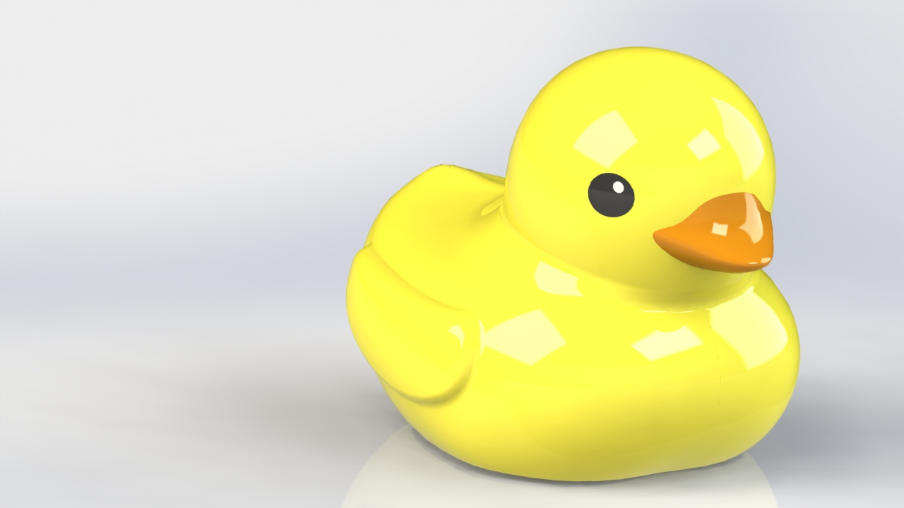

Import it in [Onshape](https://www.onshape.com/), close the surface at the bottom with **Fill** and export it:

- as `step` (STEP 242) which allows importing in FreeCAD preserving colors.

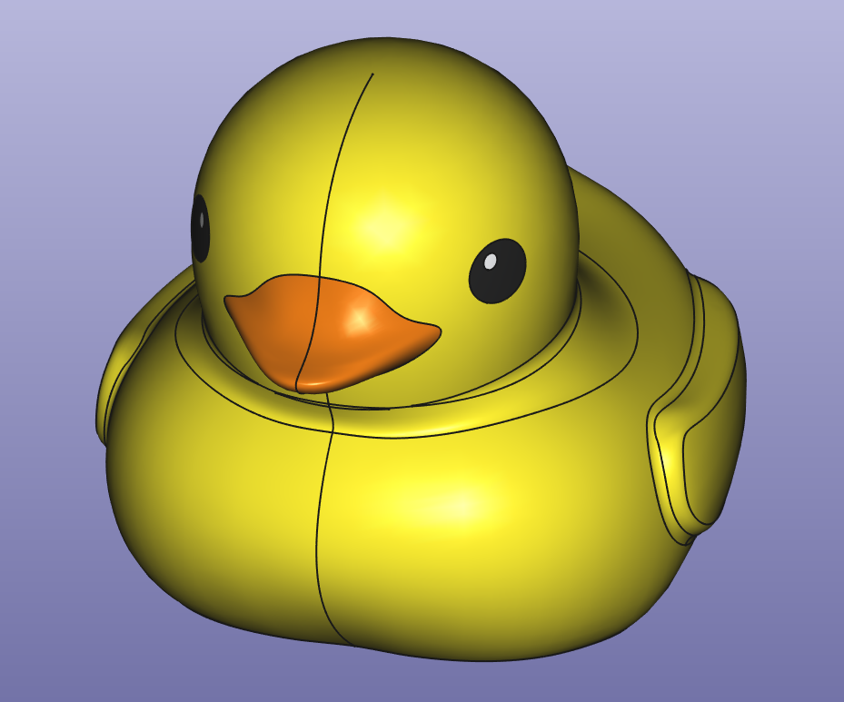

- as `dae` and `obj` which are the formats recommended to import in gazebo. Note: to preserve colors, keep the `obj` together with the matching `mtl` material file in the same folder. If you rename the files, you need to manually update the name of the `mtl`inside the first lines of the `obj`  file. 

Initially I did not realize the model contained extra curves and this later caused trouble importing in Gazebo which were quite difficult to troubleshoot:

* e.g. `obj` format spawned in Gazebo, except the head did not display properly:
  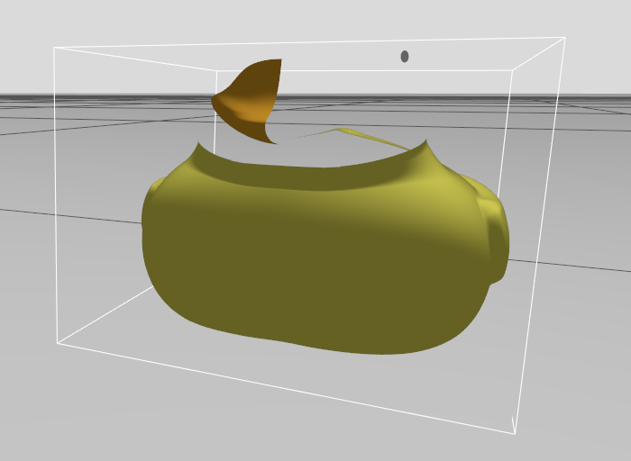

  

*  `dae` crashed Gazebo complaining of missing normals in the mesh:

```bash
[Err] [CustomMeshShape.cc:144] One of the submeshes [...] does not have a normal count [0] that matches its vertex count [128]. This submesh will be ignored!
...
Segmentation fault (Address not mapped to object [0x4])
```

A combination that did work was using the `dae` for `visual` only, and the `obj`  (or an `stl`) for `collision`. Interestingly, a white line was visible on the side of the duckie's head in Gazebo when using the `dae` as visual, and this put me on the right track to solve the issue. Turned out the model had some extra curves and this corrupted the exports. Fixed with:  clean up the extra curves either in the SLDPRT using Onshape before exporting or in the `obj` using Blender (less obvious). 

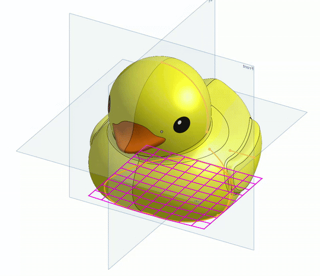

After this, the  `dae` works properly in Gazebo

Success!

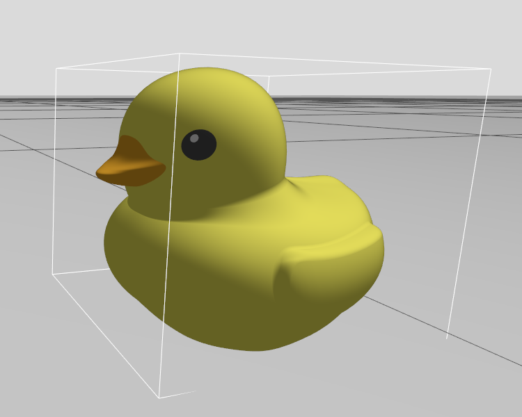

Optional: use a simplifed obj mesh as `collision`to improve performance. Load the `obj`in [Instant Meshes](https://github.com/wjakob/instant-meshes) utility and simplify the mesh, save it as `duckie_collision.obj`.

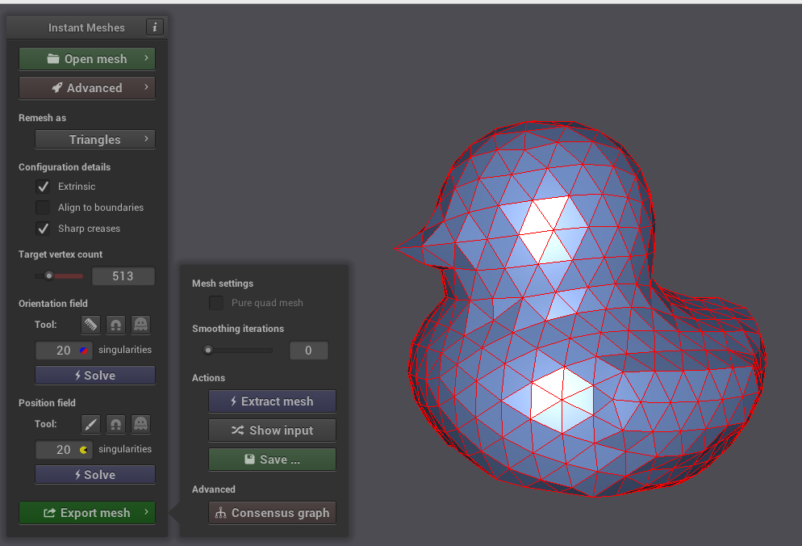

## Creating a package

Create the package:

* copy the `gamecity` package to `/src/duckieworld`
* rename project `duckieworld` in `CMakelists.txt` and `package.xml`
* symlink the package to `dev_ws` workspace and compile it

```bash
$ ln -s /home/mhered/my_SOARM100/src/duckieworld /home/mhered/dev_ws/src/
$ cd /home/mhered/dev_ws
$ colcon build --symlink-install
Starting >>> duckieworld
...                               
Finished <<< duckieworld [1.77s]                  

Summary: 4 packages finished [1.93s]
```

* copy the `gazebo.launch.py` launch file from `~/bar_ws/src/bar_examples/krytn/` edit `CMakeLists.txt` to install `launch` folder
* compile, source and launch gazebo:

```bash
$ colcon build --symlink-install
$ source install/setup.bash
$ ros2 launch duckieworld gazebo.launch.py
```

Note: Gazebo could not find the models because the environment variable `GZ_SIM_RESOURCE_PATH` must include the `share` directory where the models live for Gazebo to find them. 

Fixed with: use as template instead the launch file from `~/bar_ws/src/krytn_tray`, which sets the environment variables `GZ_SIM_RESOURCE_PATH`  (and `SDF_PATH`  for good measure, but I believe this one is not actually needed) to include the `share` of the package (only during the active session) 

Still was not finding the files. Fixed with: edit the `<uri>` tags in:

* `duckieworld.sdf` 

```xml
<!-- from: -->
<uri>model://duckieworld/models/duckie</uri>
<!-- to: -->
<uri>model://duckie/</uri>
```

* and each one of the `model.sdf` files:

```xml
<!-- from: -->
 <uri>model://duckieworld/models/whitecube/meshes/whitecube.dae</uri>
<!-- to: -->
 <uri>meshes/whitecube.dae</uri>
```

(remove `model://` and make path relative to `model.sdf`)

This worked temporarily although later I found a better fix

### Set inertia properties

Duckie measures approx 40mm height, 50mm width, and weighs 10g. 

I approximate moments of inertia (about the center of mass, aligned with the Z axis) as a thin-walled cylinder 10g, 50mm diameter, 40mm height
$$
I_{xx} = I_{yy} = \frac{1}{12} \, m \left( 3R^2 + h^2 \right)\\
I_{zz} = m R^2
$$

which yields:

```xml
<inertial>
  <mass>0.01</mass>
  <inertia>
    <ixx>2.90e-6</ixx>
    <iyy>2.90e-6</iyy>
    <izz>6.25e-6</izz>
    <ixy>0.0</ixy>
    <ixz>0.0</ixz>
    <iyz>0.0</iyz>
  </inertia>
</inertial>

```

Somehow this breaks Gazebo, I have to modify slightly the values otherwise it crashes:

```xml
<inertial>
  <mass>0.01</mass>
  <inertia>
    <ixx>3.00e-6</ixx>
    <iyy>3.00e-6</iyy>
    <izz>6.00e-6</izz>
    <ixy>0.0</ixy>
    <ixz>0.0</ixz>
    <iyz>0.0</iyz>
  </inertia>
</inertial>
```


### To do

- [ ] Why a small change in inertia breaks things?
- [ ] review the changes I made in light of what I learnt later:  setting `GZ_SIM_RESOURCE_PATH` may not work together with `gz_sim.launch.py` as the latter seems to mess up with environments (has some facilities to pass them as arguments).

## eco_disaster

### Preparing barrel models for import in Gazebo

Source: https://piwars.org/2024-disaster-zone/challenges/eco-disaster/

In FreeCAD change apperance to define colors, export as `.obj` and `.dae`, simplify mesh in Instant Meshes. 

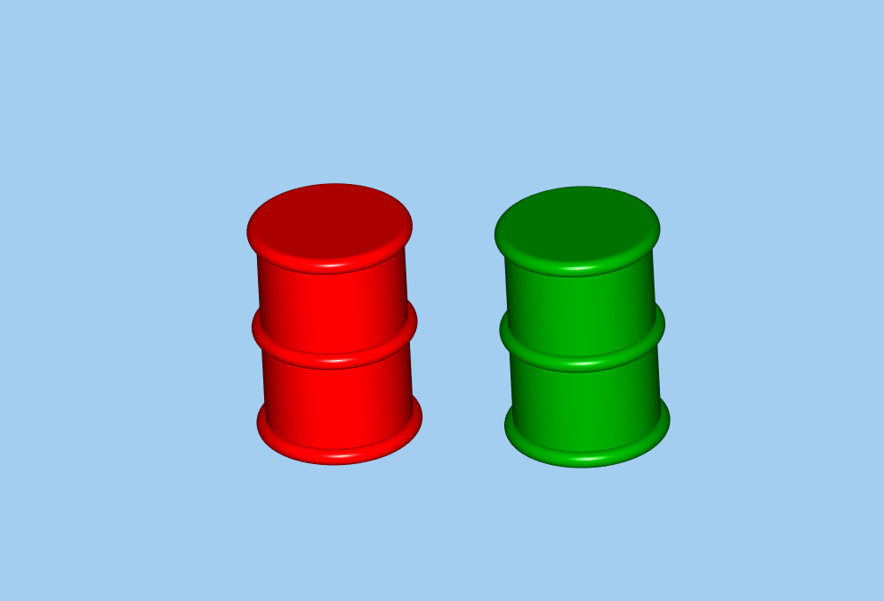

approximate inertias as solid cylinder 45g weight, 50mm diameter, 80mm height
$$
I_{xx} = I_{yy} = \frac{1}{12} m (3R^2 + h^2)
$$

$$
I_{zz} = \frac{1}{2} m R^2
$$

```xml
<inertial>
  <mass>0.045</mass>
  <inertia>
    <ixx>3.10e-5</ixx>
    <iyy>3.10e-5</iyy>
    <izz>1.41e-5</izz>
    <ixy>0.0</ixy>
    <ixz>0.0</ixz>
    <iyz>0.0</iyz>
  </inertia>
</inertial>

```

Make simplified mesh for collision.

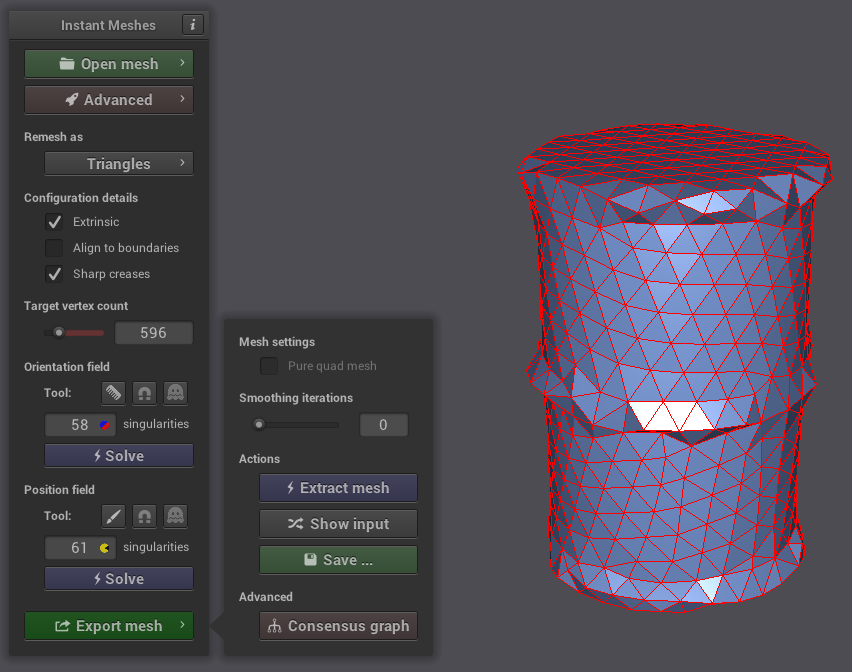

Adjust scale to 0.001 (dimensions in mm not m!). It works!

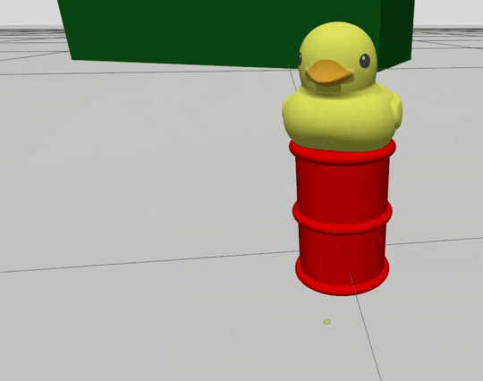

Note: `.dae` failed, `.obj` caused warnings , usigng the simplified `.obj` in `collision` worked

### Modelling the arena

Source (diagram): https://piwars.org/2024-disaster-zone/challenges/eco-disaster/

| Config 1                                            | Config 2                                            |                                                              |
| --------------------------------------------------- | --------------------------------------------------- | ------------------------------------------------------------ |
| 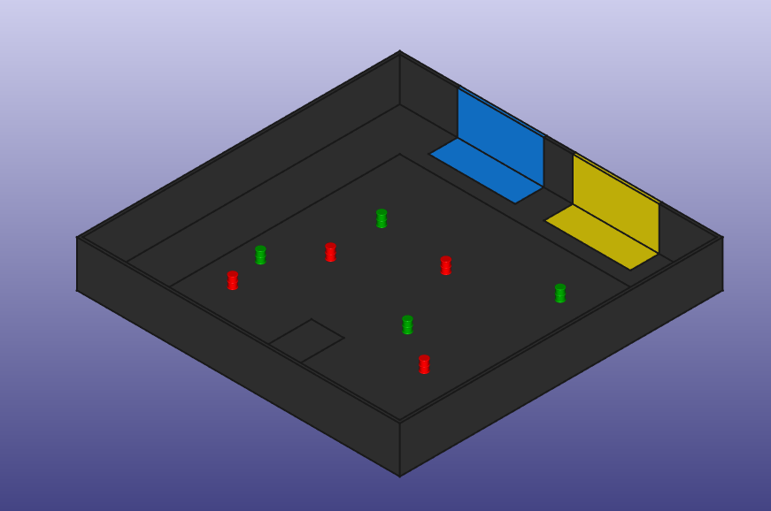        | 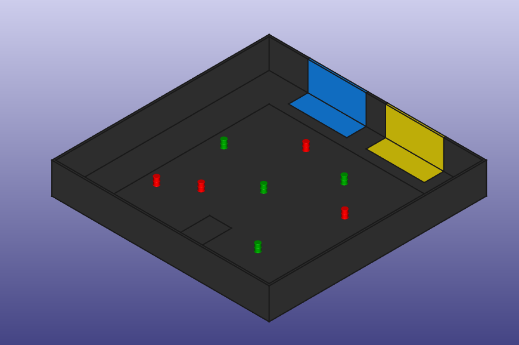        | FreeCAD models (eco_disaster.FCStd)                          |
| 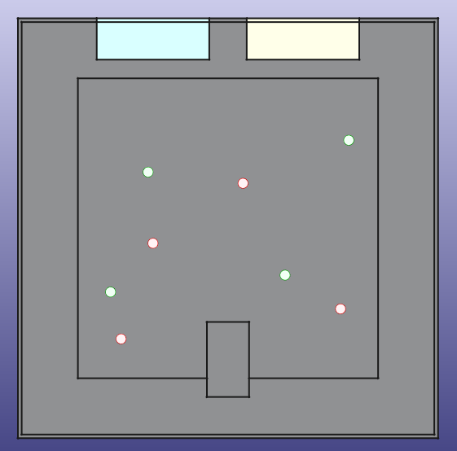    | 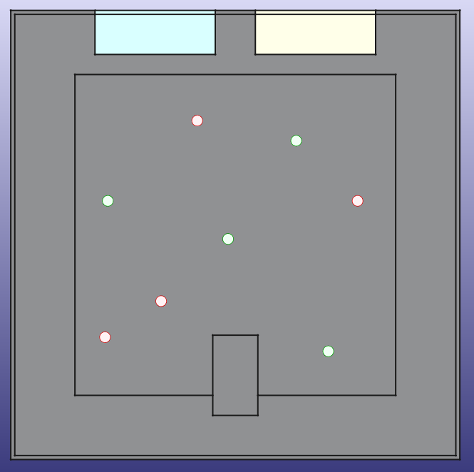    | FreeCAD, top view                                            |
| 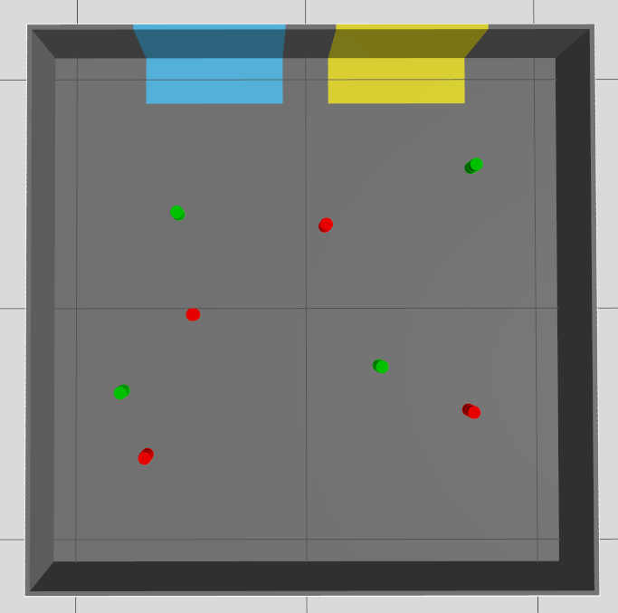 | 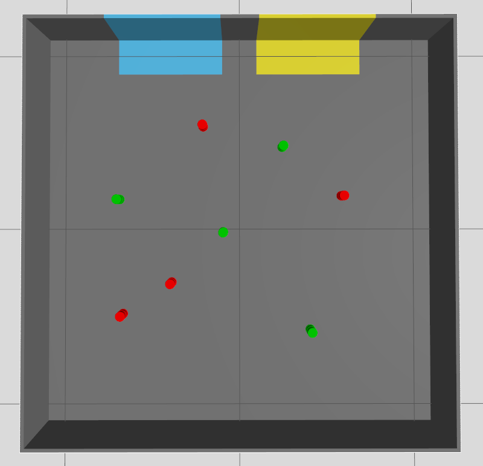 | Gazebo, top view. Coordinates calculated approximately from top view of FreeCAD model using ChatGPT |

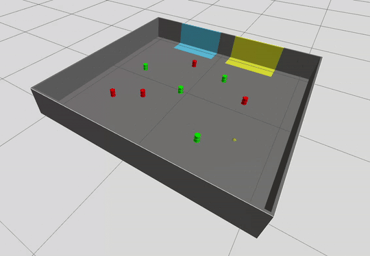

